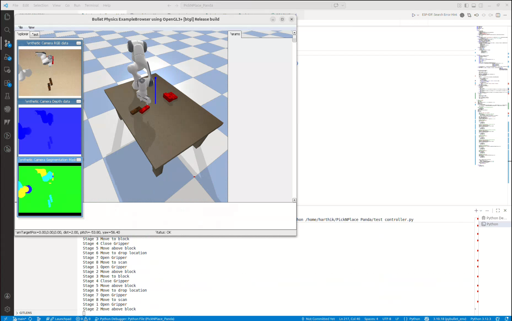

# PickNPlace_Panda
Pick and place pipeline using panda robot arm

# Video click on image to play

# Vision Processing
The position of the blocks is caclulated in the camera frame
Segmentation mask -> Bounding Rectangle -> Center of Bounding Rectangle for position -> Angle calculated using cv2.moments -> Position and rotation transformed to world frame -> Position used to solve IK and move arm -> Pick block and place and set location

In order to pick the blocks in a logical order I sort the blocks based on their distance from the camera so that the blocks at the top are selected first.
To evaluate if the block is successfully picked and placed the position of the block is calculated again once the robot attempts to pick and place the block. If the block is not picked or dropped the robot will go back to the pile and pick the block on top again until all blocks are picked and placed.

